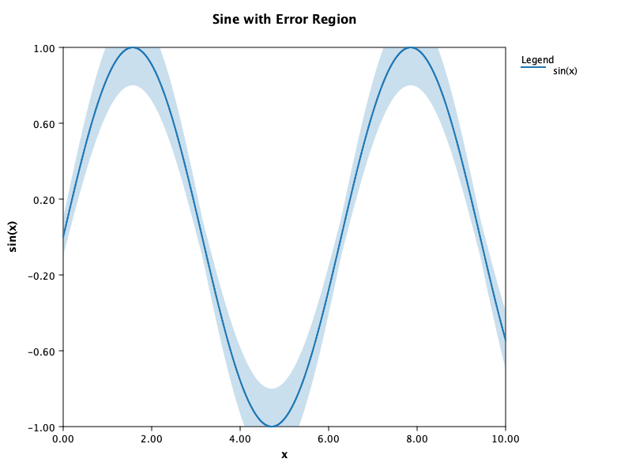

# 🧩 KPlotLib (kplotlib)

A lightweight, dependency-free 2D plotting library for **Kotlin (JVM)** — inspired by Matplotlib, written in pure Java2D.

---

## ✨ Features

- ✅ Simple `plot { }` DSL
- ✅ Line and scatter plots
- ✅ Legends and labelled axes
- ✅ Anti-aliased rendering
- ✅ Colour cycling for multiple series
- ✅ Shaded error regions
- ✅ Live animation (10–60 fps)
- ✅ Auto-resizing and optional auto-scaling axes
- ✅ No dependencies beyond the Kotlin standard library
- ✅ Output to .svg or .png, and can be run headless

---

## 🚀 Quick Start

### 1️⃣ Add dependency (via JitPack)

Add this to your **project’s `build.gradle.kts`:**

```kotlin
repositories {
    maven("https://jitpack.io")
}

dependencies {
    implementation("com.github.simonlucas:kplotlib:1.0.0")
}
```

### 2️⃣ Static Example

```kotlin
import sml.plotlib.core.line
import sml.plotlib.core.plot
import kotlin.math.*

fun main() {
    val x = (0..200).map { it / 20.0 }
    val y1 = x.map { sin(it) }
    val y2 = x.map { cos(it) }

    val p = plot("Sine and Cosine") {
        xlabel = "x"
        ylabel = "f(x)"
        line("sin(x)", x, y1)
        line("cos(x)", x, y2)
    }

    p.show()
}
```

### Other examples

See [examples folder](./src/main/kotlin/sml/plotlib/examples)

Example output (written directly to .png file)



Example output (direct to .svg file - smoother than .png)

|[Figure](./docs/img/example-error-regions.svg)

